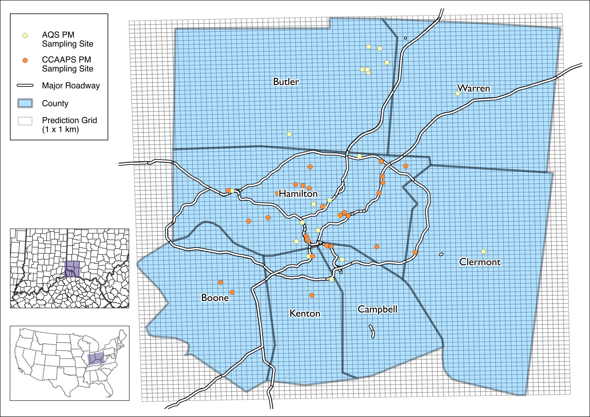
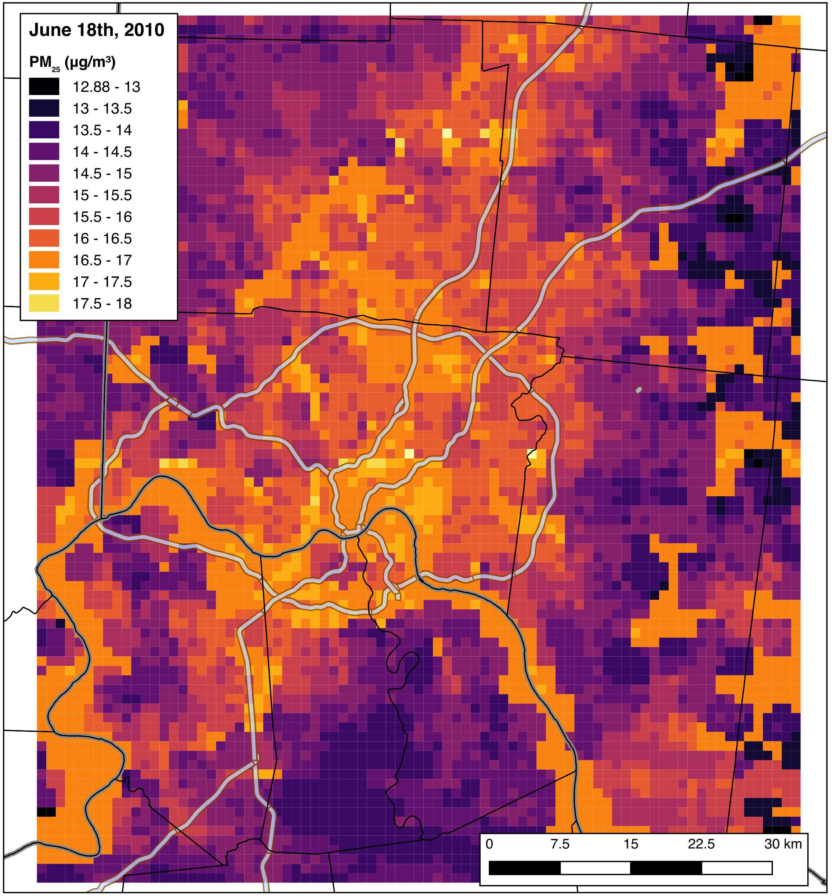
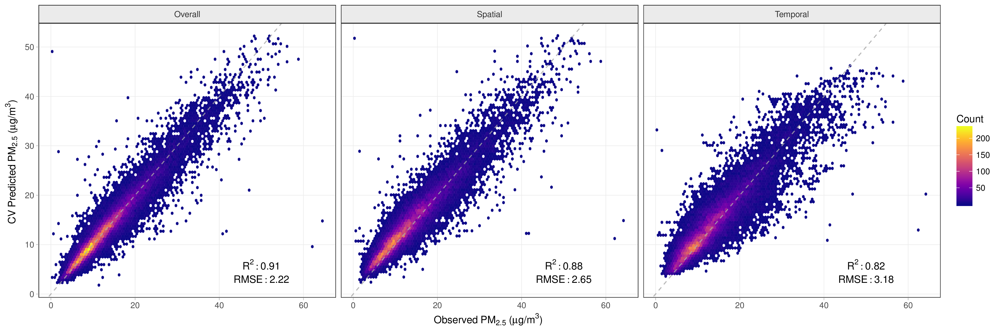

---
output:
  md_document:
    variant: markdown_github
---

<!-- README.md is generated from README.Rmd. Please edit that file -->

```{r, echo = FALSE}
knitr::opts_chunk$set(
  collapse = TRUE,
  comment = "#>",
  fig.path = "README-"
)
```


# aiR

aiR is used to assess exposures to ambient particulate matter smaller than 2.5 micrometers (PM2.5) in the Cincinnati, Ohio area. The package creates predictions based on a spatiotemporal hybrid satellite/land use random forest model. Exposure predictions are available as daily averages at a 1 x 1 km grid resolution covering the "seven county" area (OH: Hamilton, Clermont, Warren, Butler; KY: Boone, Kenton, Campbell) from 2000 - 2015:



For example, below are the PM2.5 predictions for June 18th, 2010:



Cross validation of the model indicates that the PM2.5 predictions are excellent across the study domain, with a cross-validated median absolute error of 0.95 micrograms per cube meter and a cross-validated $R^2$ of 0.91.



## Reference

Please see our publication below for details on the data source, land use forest model, and cross validated accuracy. Please cite this manuscript if you use our package in a scientific publication:

Cole Brokamp, Roman Jandarov, Monir Hossain, Patrick Ryan. Predicting Daily Urban Fine Particulate Matter Concentrations Using Random Forest. *Environmental Science & Technology*. 52 (7). 4173-4179. 2018.

## Installing

aiR is hosted on GitHub; install with:

```{r eval=FALSE}
remotes::install_github('cole-brokamp/aiR')
```

## Example Usage

This example covers how to extract PM2.5 exposure estimates given latitude/longitude coordinates and dates.

Note that `pm_grid` and `pm_data` are both R objects that will be available upon loading of the package. However, `pm_data` has to be split into two smaller files (`pm_data_early` and `pm_data_late`) to be under GitHub's 100 MB filesize limit.  This workaround requires binding the two datasets into one upon package loading.

```{r}
library(aiR)
library(tidyverse)
pm_data <- bind_rows(pm_data_early, pm_data_late)
```


Create a demonstration dataset of random coordinates and dates:

```{r}
d <- tibble::tribble(
  ~id,         ~lon,        ~lat,
    809089L, -84.69127387, 39.24710734,
    813233L, -84.47798287, 39.12005904,
    814881L, -84.47123583,  39.2631309,
    799697L, -84.41741798, 39.18541228,
    799698L, -84.41395064, 39.18322447
  )

set.seed(12)

d <- d %>%
    mutate(date = seq.Date(as.Date('2015-01-01'), as.Date('2015-12-31'), by = 1) %>%
             base::sample(size=nrow(d)))
```

Convert this to a simple features object and transform to the Ohio South projection. Reprojection is necessary because `pm_grid` is in the Ohio South projection.

```{r example}
library(sf)

d <- d %>%
  st_as_sf(coords = c('lon', 'lat'), crs=4326) %>%
    st_transform(3735)
```


To estimate the exposures, we will first overlay the locations with the PM2.5 exposure grid to generate the `pm_grid_id` for each location.

```{r}
( d <- st_join(d, pm_grid) )
```


Then merge the "lookup grid" (`pm_grid`) into the dataset by using `pm_grid_id` and `date`. Note that for the merge to work, the date column must be named `date` and be of class `Date` and the `pm_grid_id` column must exist.

```{r}
( d <- left_join(d, pm_data, by = c('pm_grid_id', 'date')) )
```


## Adding Weather Data

Several NARR weather variables are available as daily means for the entire study area in the `narr_data` R object. View the help (`?narr_data`) to see more details about the individual variables.

To merge in humidity and temperature, we will subset `narr_data` to those variables and join to our dataset:

```{r}
( d <- left_join(d, narr_data %>% select(date, air.2m, rhum.2m), by = 'date') )
```

